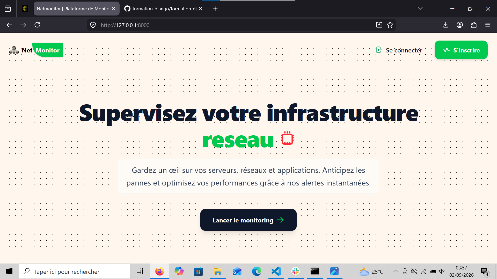
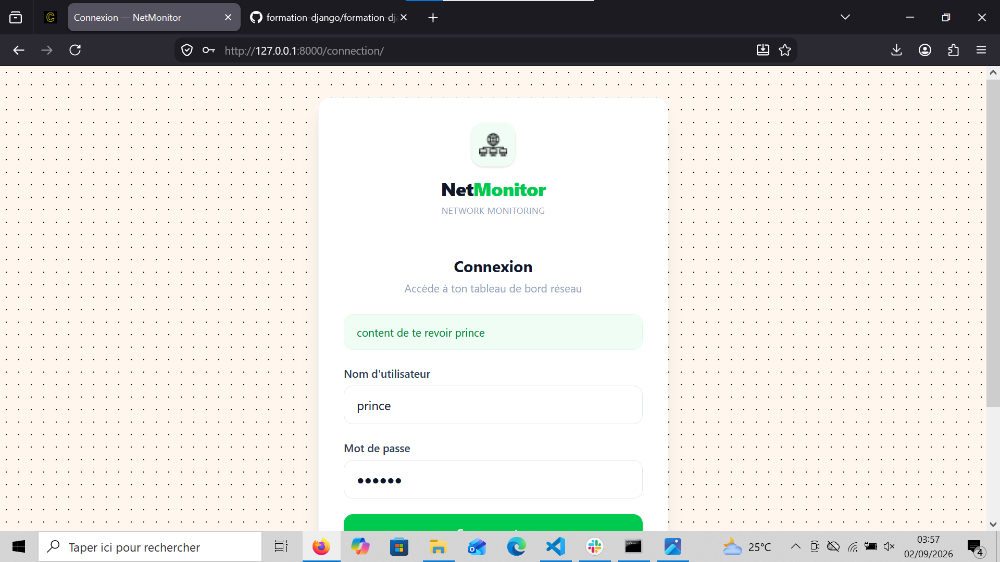
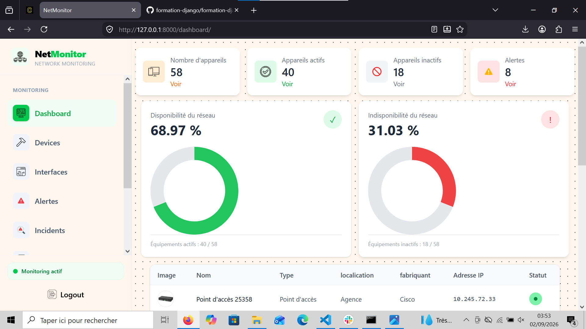
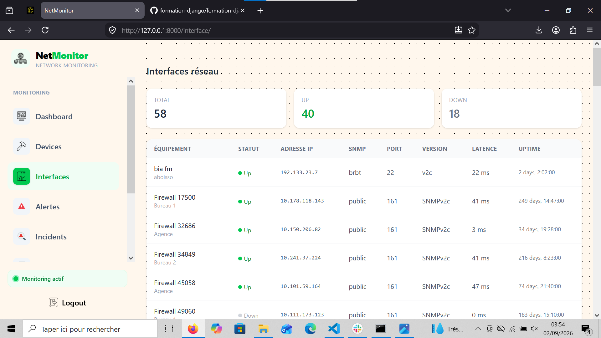
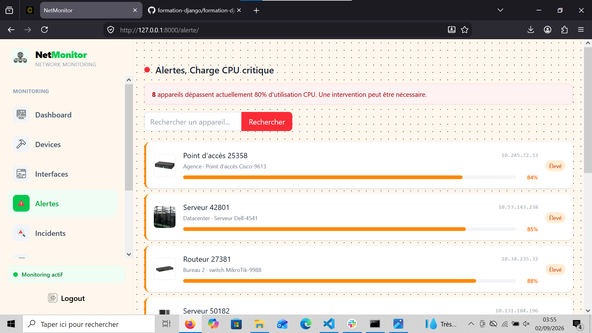
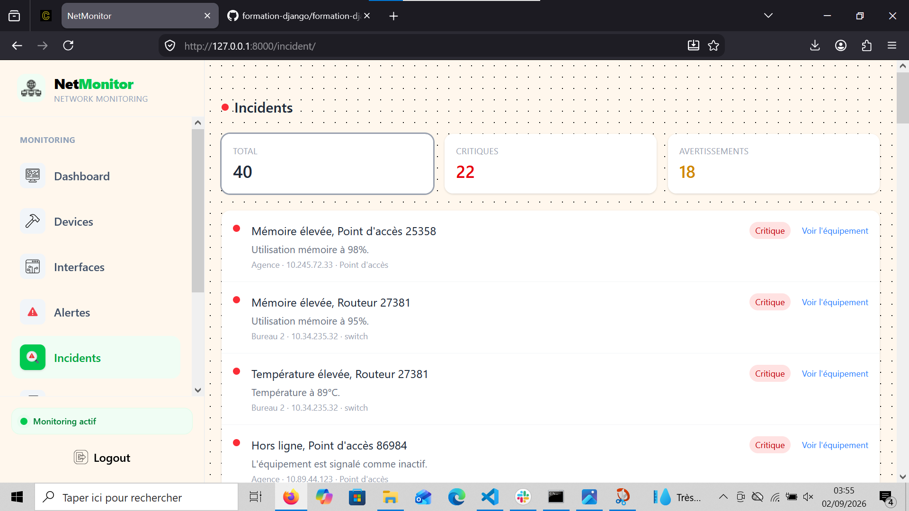
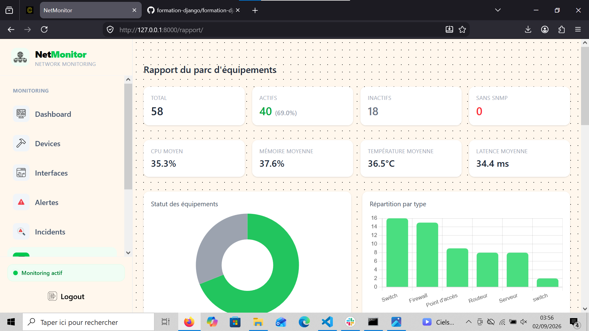
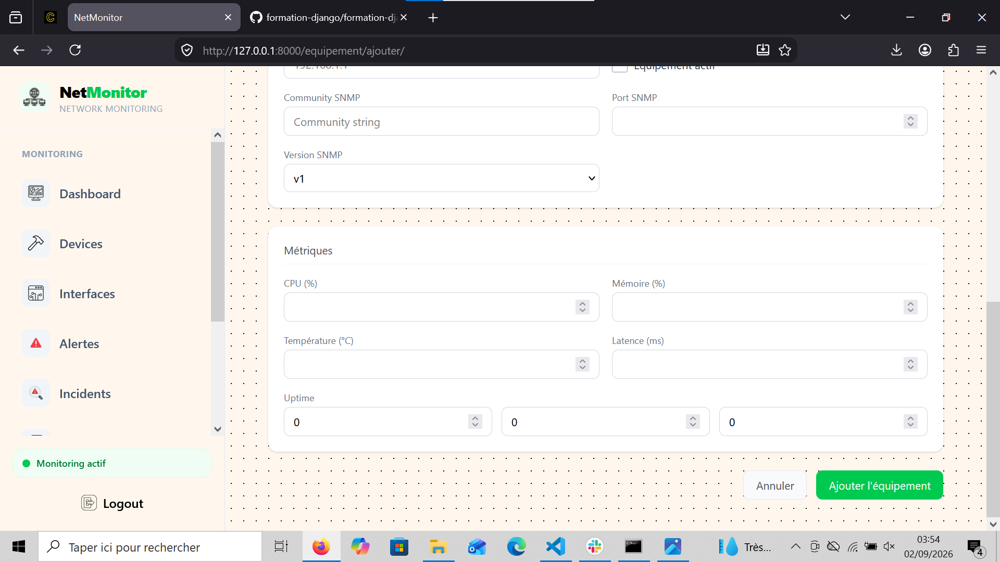
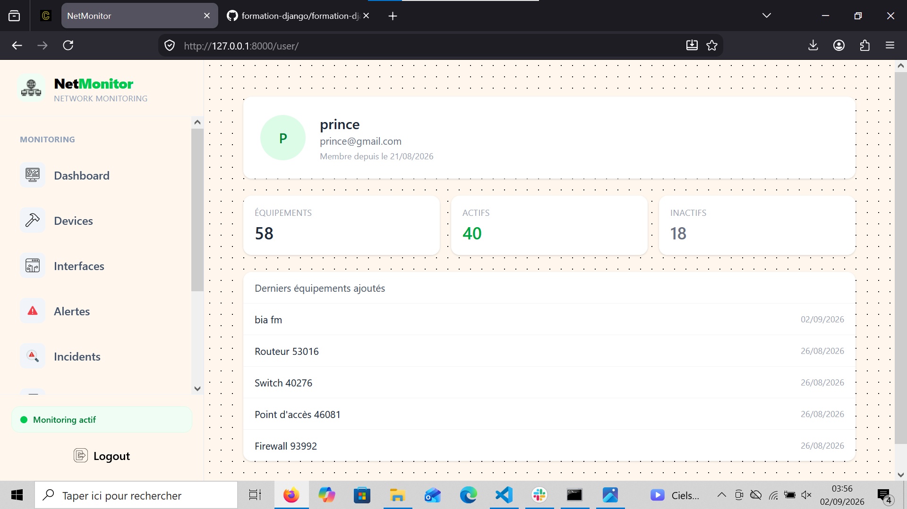
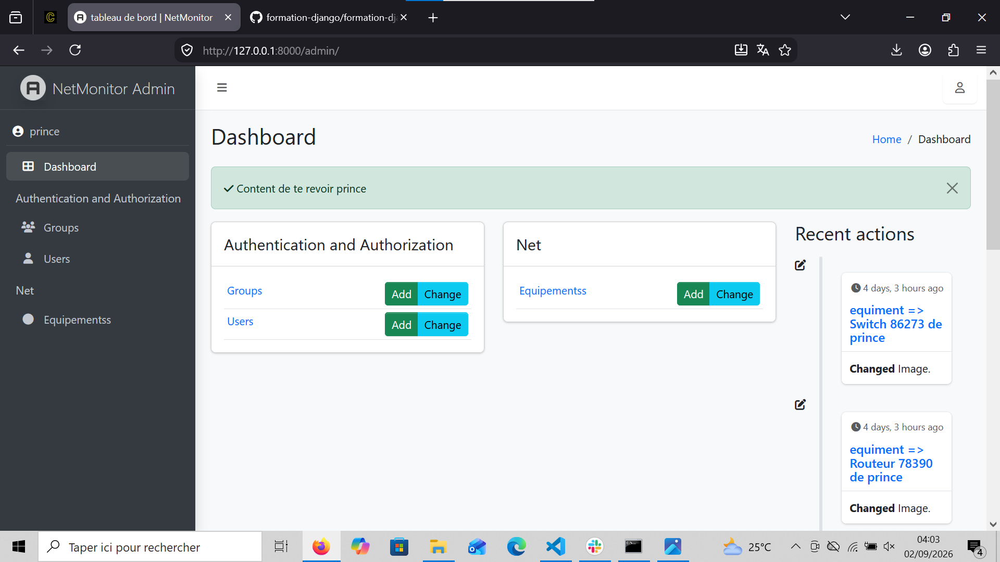

# NetMonitor

Plateforme de supervision et de gestion d'infrastructure réseau développée avec Django. Elle permet de suivre l'état des équipements, détecter les anomalies, gérer les alertes, analyser les performances et exporter les données pour une meilleure visibilité sur le parc informatique.

## Aperçu

NetMonitor est une application web orientée réseau et infrastructure IT. Elle permet à un administrateur ou à un utilisateur de centraliser les informations de ses équipements, contrôler leur disponibilité, identifier les incidents et consulter des rapports synthétiques.

## Fonctionnalités principales

- Tableau de bord avec statistiques globales
- Gestion des équipements réseau
- Suivi du statut : actif / inactif
- Analyse des performances : CPU, mémoire, température et latence
- Détection automatique des incidents et alertes
- Gestion des utilisateurs et des accès
- Pages dédiées aux appareils actifs, appareils inactifs et alertes
- Export Excel et PDF des listes d'équipements
- Rapports visuels avec données agrégées
- Interface d'administration Django

## Captures d'écran

### Page d'accueil



### Connexion



### Dashboard



### Gestion des interfaces réseau



### Alertes



### Incidents



### Rapports



### Formulaire d'ajout / modification d'équipement



### Profil utilisateur



### Administration



### Interface principale


## Stack technique

- Python
- Django
- PostgreSQL
- Tailwind CSS
- Chart.js
- Pandas
- WeasyPrint
- Django Environ
- Bootstrap / interface personnalisée Django

## Prérequis

Avant de lancer le projet, assurez-vous d'avoir installé :

- Python 3.10 ou plus
- PostgreSQL
- Node.js et npm
- Git

## Installation

1. Cloner le projet

```bash
git clone https://github.com/attobraprince34-sketch/NetMiko.git
cd net_monitor
```

2. Créer un environnement virtuel

```bash
python -m venv .venv
```

3. Activer l'environnement virtuel

Sur Windows PowerShell :

```powershell
.\.venv\Scripts\Activate.ps1
```

Sur Windows CMD :

```cmd
.venv\Scripts\activate.bat
```

4. Installer les dépendances Python

```bash
pip install -r requirements.txt
```

5. Installer les dépendances frontend

```bash
npm install
```

6. Créer un fichier .env à la racine du projet avec les variables suivantes :

```env
DEBUG=TRUE
SECRET_KEY=votre_cle_secrete
DB_NAME=net
DB_USER=postgres
DB_PASSWORD=votre_mot_de_passe
DB_HOST=localhost
DB_PORT=5432
```

7. Appliquer les migrations

```bash
python manage.py migrate
```

8. Créer un superutilisateur pour accéder à l'administration Django

```bash
python manage.py createsuperuser
```

## Lancement du projet

Démarrer le serveur Django :

```bash
python manage.py runserver
```

Le projet est ensuite accessible à l'adresse :

```text
http://127.0.0.1:8000/
```

## Commandes utiles

Pour compiler le CSS Tailwind en mode production :

```bash
npm run build
```

Pour surveiller les changements CSS pendant le développement :

```bash
npm run dev
```

## Structure du projet

```text
net_monitor/
├── config/
│   ├── __init__.py
│   ├── settings.py
│   ├── urls.py
│   ├── wsgi.py
│   └── asgi.py
├── net/
│   ├── migrations/
│   ├── templates/
│   ├── admin.py
│   ├── alerte.py
│   ├── apps.py
│   ├── forms.py
│   ├── froms.py
│   ├── models.py
│   ├── tests.py
│   ├── urls.py
│   └── views.py
├── static/
│   ├── css/
│   ├── images/
│   └── js/
├── manage.py
├── requirements.txt
├── package.json
├── .env
├── .gitignore
├── readme.md
└── db.sqlite3
```

## Modèle de données

Le projet repose sur un modèle principal `Equipements` contenant les informations suivantes :

- nom
- adresse IP
- type d'équipement
- fabricant
- modèle
- localisation
- community SNMP
- port SNMP
- version SNMP
- uptime
- statut
- CPU
- mémoire
- température
- latence
- propriétaire
- date de création

## Cas d'utilisation

NetMonitor est adapté pour :

- superviser des équipements réseau d'une petite ou moyenne infrastructure
- centraliser l'état des dispositifs dans un tableau de bord unique
- identifier rapidement les pannes ou anomalies de performances
- produire des rapports de suivi pour les équipes techniques
- gérer les appareils actifs, inactifs et soumis à des alertes

## Licence

Ce projet est sous licence ISC.

## Auteur

Projet développé par Attobra Prince.

## Remerciements

Merci à toutes les personnes qui ont contribué à la conception et au développement de cette solution de supervision réseau.
